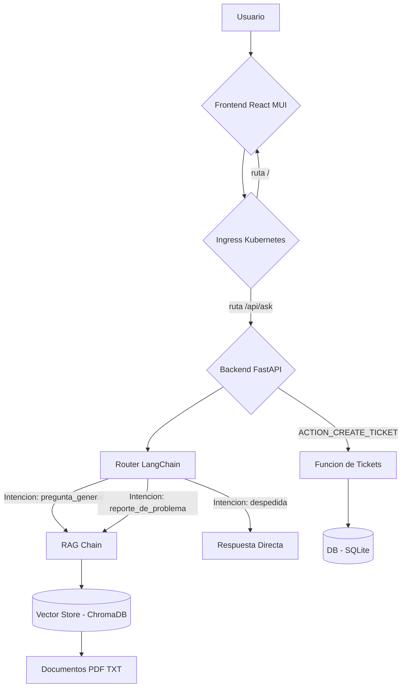

# 🚀 Corporate Knowledge Pilot

Asistente de IA conversacional para entornos corporativos, diseñado para responder preguntas basadas en una base de conocimiento interna y guiar al usuario a través de un flujo de solución de problemas antes de crear tickets de soporte.

[](https://github.com/rdiazm95/Corporate-Knowledge-Pilot/actions/workflows/ci.yaml)
[](https://opensource.org/licenses/MIT)

## 🌟 Demostración

Aquí puedes ver al chatbot en acción, respondiendo preguntas, pidiendo feedback y creando tickets de soporte solo cuando es necesario.


---

## ✨ Características Principales

- **Arquitectura RAG (Retrieval-Augmented Generation):** El bot basa su conocimiento en un conjunto de documentos privados (PDFs, TXTs) para garantizar respuestas precisas y reducir alucinaciones.
- **Router de Intenciones:** Un LLM clasifica la intención del usuario (`pregunta general`, `reporte de problema`, `despedida`) para dirigir la conversación de forma inteligente.
- **Flujo de Conversación Guiado:** En lugar de crear un ticket directamente, el bot primero ofrece una solución de la base de conocimiento. Luego, pregunta explícitamente al usuario si el problema se ha solucionado, implementando un **bucle de feedback** efectivo.
- **Creación de Tickets por Acción:** Si la solución no es suficiente, el frontend ofrece al usuario la opción de crear un ticket. Esta decisión se comunica al backend mediante un mensaje de acción especial (`ACTION_CREATE_TICKET`), demostrando un patrón de diseño robusto para agentes de IA.
- **Pila Tecnológica Local y Open-Source:** El sistema funciona 100% localmente usando Ollama con Llama 3.1 y modelos de embeddings de alto rendimiento, sin depender de APIs de pago.
- **Listo para Despliegue (Docker y Kubernetes):** El proyecto está completamente "dockerizado" y cuenta con manifiestos de Kubernetes para su orquestación, demostrando un flujo de trabajo listo para producción.
- **CI/CD Automatizado:** Un workflow de GitHub Actions se encarga de construir y publicar automáticamente las imágenes de Docker en Docker Hub cada vez que se actualiza el código.

---

## 🏗️ Arquitectura del Sistema

La arquitectura consiste en un frontend que gestiona el estado de la conversación y un backend stateless que responde a cada pregunta a través de un único endpoint. La lógica de decisión reside en el router de LangChain.



## 💻 Stack Tecnológico

| Área | Tecnologías |
|------|--------------|
| **Backend** | Python, FastAPI, LangChain, Ollama (Llama 3.1), Uvicorn |
| **IA & NLP** | RAG, Hugging Face Embeddings (`multilingual-e5-large`), ChromaDB |
| **Frontend** | React, TypeScript, Material-UI (MUI), Vite |
| **Base de Datos** | SQLite |
| **DevOps** | Docker, Docker Compose, Kubernetes, NGINX Ingress, GitHub Actions |

## 🛠️ Cómo Empezar

### 🔧 Prerrequisitos

- 🐳 **Docker Desktop** instalado y funcionando (con Kubernetes activado).  
- 🧠 **Ollama** instalado y ejecutándose, con el modelo `llama3.1:8b` descargado:

```bash
ollama pull llama3.1:8b
```
### 🚀 Opción 1: Docker (Recomendada)

Esta es la forma más sencilla de lanzar toda la aplicación.

#### 1️⃣ Clona el repositorio

```bash
git clone https://github.com/tu-usuario/tu-repositorio.git
cd tu-repositorio
```
#### 2️⃣ Clona el repositorio

```bash
docker-compose up --build
```
Accede a la interfaz 👉 http://localhost:5173

### 💻 Opción 2: Entorno de Desarrollo Local

#### 1️⃣ 🐍 Backend

```bash
cd backend
python -m venv .venv
.venv\Scripts\activate
pip install -r requirements.txt
uvicorn main:app --reload
```
---
#### 2️⃣  🎨 Frontend
```bash
cd frontend
npm install
npm run dev
```
### ☸️ Opción 3: Despliegue en Kubernetes

#### 1️⃣ 🐳 Publica tus Imágenes

Asegúrate de que tus imágenes **backend** y **frontend** están correctamente **etiquetadas y subidas a tu cuenta de Docker Hub**.

---

#### 2️⃣ 🧾 Actualiza los Manifiestos

Edita el archivo:

```bash
kubernetes/manifests.yaml
```
Y reemplaza tu-usuario-docker por tu nombre de usuario en Docker Hub

---

 #### 3️⃣ ✅ Aplica la Configuración 

```bash
kubectl apply -f kubernetes/manifests.yaml
```

---

#### 4️⃣ Accede a la aplicación: Abre tu navegador en http://localhost.
(Interfaz en blanco)


---

### 🗺️ Hoja de Ruta (Próximos Pasos)
Este proyecto seguirá creciendo. Las siguientes fases planeadas son:

- 🧱[ ] **Terraform:** Escribir código de Infraestructura como Código (IaC) para provisionar un clúster de Kubernetes en la nube (ej. Azure     AKS).

- 📊[x] **Monitorización:** Integrar Prometheus y Grafana para monitorizar la salud y el rendimiento de la aplicación.

- 🔒[ ] **Seguridad:** Implementar un sistema de autenticación (conceptual, con OAuth2) y mejorar los bucles de feedback de usuario para el reentrenamiento del modelo.

---

### 📄 Licencia

Este proyecto está bajo la [Licencia MIT](https://opensource.org/license/MIT).

© 2025 — Desarrollado con ❤️ por [rdiazm95](https://www.linkedin.com/in/rubendim/)
